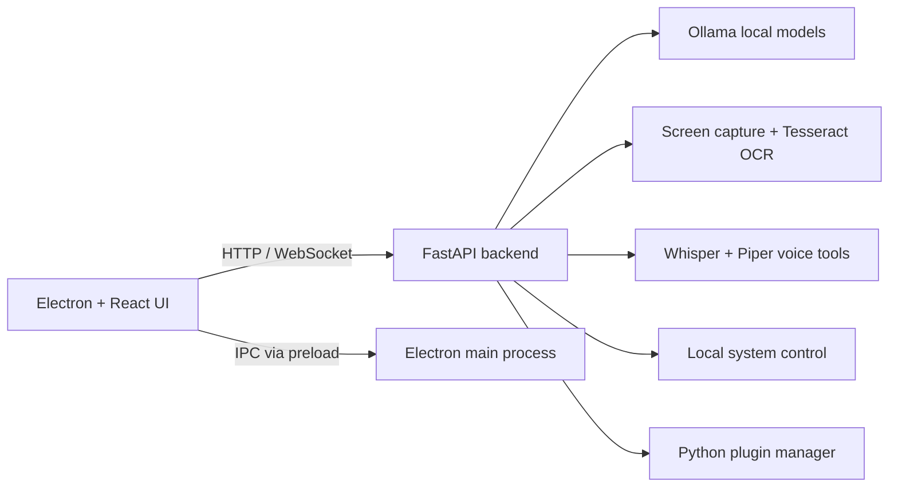

# BASIC-JARVIS

> A local-first desktop AI assistant that combines an Electron interface, a FastAPI backend, and Ollama-powered language models.

[](https://github.com/vincenzo-afk/BASIC-JARVIS/actions/workflows/ci.yml)
[](LICENSE)
[](https://www.python.org/)
[](https://nodejs.org/)
[](https://www.electronjs.org/)

[Report a bug](https://github.com/vincenzo-afk/BASIC-JARVIS/issues/new?template=bug_report.md) · [Request a feature](https://github.com/vincenzo-afk/BASIC-JARVIS/issues/new?template=feature_request.md) · [View the API docs](http://localhost:8000/docs)

## Table of Contents

- [About the Project](#about-the-project)
- [Tech Stack](#tech-stack)
- [Getting Started](#getting-started)
- [Usage](#usage)
- [API Reference](#api-reference)
- [Project Structure](#project-structure)
- [Features and Roadmap](#features-and-roadmap)
- [Testing](#testing)
- [Deployment](#deployment)
- [Contributing](#contributing)
- [Security](#security)
- [License](#license)
- [Acknowledgments](#acknowledgments)

## About the Project

BASIC-JARVIS is a local AI desktop assistant for Windows, Linux, and macOS development environments. The Electron desktop shell provides the user interface and system tray integration, while a local FastAPI service exposes chat, screen capture/OCR, voice, system-control, agent, and plugin routes. Ollama supplies the local large language model (LLM) runtime, so core chat requests can be handled without a hosted AI API key.

The project is intended for local experimentation and development. Features that read the screen, control input devices, open applications, manage audio, or execute plugins should be enabled only on a machine and account where those actions are expected.

### Key capabilities

- **Local LLM chat:** Send prompts to models available through Ollama, including streaming and multi-turn conversation routes.
- **Desktop shell:** Run the React interface inside Electron with a tray menu, hidden-to-tray behavior, and global shortcuts.
- **Screen tools:** Capture monitors and pass screenshots through the OCR pipeline when the required native tools are installed.
- **Voice tools:** Transcribe audio and synthesize speech through the configured Whisper and Piper components.
- **System control:** Expose guarded mouse, keyboard, application, and power-management routes through the backend.
- **Agent workflows:** Execute multi-step tasks using the backend action catalog.
- **Plugins:** Discover, load, reload, unload, and execute Python plugins from `backend/plugins/`.

### Architecture



## Tech Stack

| Area | Technologies | Verified source |
|---|---|---|
| Desktop UI | Electron `^39.2.6`, React `^18.2.0`, React DOM `^18.2.0`, `react-scripts` `5.0.1` | `electron-app/package.json` |
| Styling and build | Tailwind CSS `^3.3.6`, PostCSS `^8.4.32`, Autoprefixer `^10.4.16` | `electron-app/package.json` |
| Backend API | FastAPI `0.104.1`, Uvicorn `0.24.0`, Pydantic `2.5.2` | `backend/requirements.txt` |
| Local AI | Ollama Python client `0.1.3` and an Ollama server | `backend/requirements.txt`, `backend/config/settings.py` |
| Screen and OCR | `mss`, `pytesseract`, OpenCV, Pillow | `backend/requirements.txt` |
| Voice | OpenAI Whisper, PyAudio, SoundFile, Piper executable/model | `backend/requirements.txt`, `backend/config/settings.py` |
| Automation | PyAutoGUI, psutil, Playwright | `backend/requirements.txt` |
| Storage | Local filesystem for logs, temporary screenshots/audio, and plugin files | `backend/config/settings.py` |

## Getting Started

### Prerequisites

Install the following before running BASIC-JARVIS:

| Requirement | Purpose |
|---|---|
| Python 3.8 or newer | Runs the FastAPI backend and Python modules |
| Node.js 16 or newer | Installs and builds the Electron/React application |
| Ollama | Runs local language models |
| Tesseract OCR | Required for screen text extraction |
| Piper and a Piper voice model | Required for speech synthesis |
| System audio support | Required for microphone input and speech features |

The repository includes Windows batch helpers and Unix shell helpers. Native audio, OCR, and automation dependencies may require additional operating-system packages.

### Installation

Clone the repository and run the platform-specific installer:

```bash
git clone https://github.com/vincenzo-afk/BASIC-JARVIS.git
cd BASIC-JARVIS
```

On Linux or macOS:

```bash
chmod +x scripts/*.sh
./scripts/install_all.sh
```

On Windows, run `scripts\\install_all.bat` or the root-level `install_all.bat`. The installer installs `backend/requirements.txt` and the Electron dependencies.

### Configuration

Copy the example environment file and adjust paths for your machine:

```bash
cp backend/.env.example backend/.env
```

The backend loads `.env` through `python-dotenv`. The supported variables are:

| Variable | Default | Description |
|---|---|---|
| `OLLAMA_HOST` | `http://localhost:11434` | Ollama server URL |
| `DEFAULT_MODEL` | `llama3.1:8b` | Default Ollama model name |
| `TESSERACT_CMD` | Auto-detected | Full path to the Tesseract executable |
| `OCR_LANGUAGE` | `eng` | Tesseract language code |
| `WHISPER_MODEL` | `base` | Whisper model name |
| `PIPER_PATH` | `piper` | Piper executable or command path |
| `PIPER_MODEL` | `bin/piper/en_US-lessac-medium.onnx` | Piper voice model path |
| `API_HOST` | `127.0.0.1` | Backend bind address |
| `API_PORT` | `8000` | Backend port |
| `DEBUG_MODE` | `false` | Debug flag read by backend configuration |
| `LOG_LEVEL` | `INFO` | Backend log level |
| `ENABLE_OCR` | `true` | Enable screen/OCR functionality |
| `ENABLE_VOICE` | `true` | Enable voice functionality |
| `ENABLE_SYSTEM_CONTROL` | `true` | Enable input, application, and system-control routes |

Never commit `.env` files, model files, generated audio, screenshots, or logs. The repository’s `.gitignore` excludes common local artifacts and environment files.

### Start the application in development

Start the backend in one terminal:

```bash
./scripts/run_backend.sh
```

Start the Electron development shell in a second terminal:

```bash
./scripts/start_electron.sh
```

On Windows, use `scripts\\run_backend.bat` and `scripts\\start_electron.bat`. The backend is available at `http://127.0.0.1:8000`; interactive OpenAPI documentation is available at `http://127.0.0.1:8000/docs`.

### Pull an Ollama model

Make sure Ollama is running, then pull a model supported by your machine:

```bash
ollama pull llama3.1:8b
```

The model name can be overridden with `DEFAULT_MODEL` or supplied in an API request.

## Usage

### Electron shell

The desktop shell loads the React production bundle from `electron-app/build/index.html`. The development command starts the React development server and launches Electron in development mode so that the shell loads `http://localhost:3000`.

The implemented global shortcuts are:

| Shortcut | Action |
|---|---|
| `Alt+Space` | Show, focus, or hide the JARVIS window |
| `Ctrl+Shift+J` on Windows/Linux, `Cmd+Shift+J` on macOS | Show the window and focus the input |
| `F12` | Toggle Electron DevTools while the window is focused |

The tray menu can show the window, open settings, or quit the application. Closing the window hides it rather than terminating the process on Windows and Linux.

### Backend health

```bash
curl http://127.0.0.1:8000/health
```

The response reports backend status, Ollama connectivity, CPU information, and availability of chat, OCR, voice, agent, and plugin modules.

### Send a local chat request

```bash
curl -X POST http://127.0.0.1:8000/api/chat/ \
  -H 'Content-Type: application/json' \
  -d '{"model":"llama3.1:8b","prompt":"Explain what BASIC-JARVIS does in one sentence."}'
```

The chat endpoint returns a JSON object containing `response`, `model`, and optional token and duration fields. If Ollama is unavailable, the backend returns a service-unavailable error.

## API Reference

The FastAPI service is rooted at `http://127.0.0.1:8000`. OpenAPI documentation is served at `/docs` and `/redoc`.

### Core and chat

| Method | Path | Purpose |
|---|---|---|
| `GET` | `/` | Backend service summary |
| `GET` | `/health` | Health and module availability |
| `POST` | `/api/chat/` | Generate a response from an Ollama model |
| `POST` | `/api/chat/conversation` | Generate a response from message history |
| `GET` | `/api/chat/models` | List locally available Ollama models |
| `GET` | `/api/chat/models/{model_name}` | Retrieve model information |
| `POST` | `/api/chat/models/{model_name}/pull` | Pull a model through Ollama |
| `POST` | `/api/chat/stream` | Stream a response as Server-Sent Events |
| `WS` | `/api/chat/ws` | Exchange chat messages over WebSocket |

The basic chat request accepts `model`, required `prompt`, optional `system`, optional `temperature` from `0.0` to `2.0`, and optional `max_tokens`.

### Screen and OCR

| Method | Path | Purpose |
|---|---|---|
| `POST` | `/api/screen/read` | Capture a monitor region and run OCR |
| `POST` | `/api/screen/capture` | Capture a monitor image |
| `GET` | `/api/screen/monitors` | List available monitors |
| `POST` | `/api/screen/ocr` | Run OCR against an existing image path |

### Voice

| Method | Path | Purpose |
|---|---|---|
| `GET` | `/api/voice/status` | Report speech component availability |
| `POST` | `/api/voice/transcribe` | Transcribe uploaded audio |
| `POST` | `/api/voice/transcribe-raw` | Transcribe raw uploaded audio |
| `POST` | `/api/voice/speak` | Synthesize speech |
| `POST` | `/api/voice/speak-async` | Start asynchronous speech synthesis |
| `GET` | `/api/voice/speak/download/{filename}` | Download generated audio |
| `GET` | `/api/voice/voices` | List available voices |
| `POST` | `/api/voice/detect-language` | Detect language from uploaded audio |
| `POST` | `/api/voice/voice-chat` | Combine transcription, agent processing, and optional speech |
| `POST` | `/api/voice/speak-base64` | Return synthesized audio as Base64 data |

### System control, agents, and plugins

| Area | Representative routes |
|---|---|
| System control | `/api/control/mouse/*`, `/api/control/keyboard/*`, `/api/control/app/*`, `/api/control/system/*` |
| Agents | `/api/agent/run`, `/api/agent/workflow`, `/api/agent/status/{agent_id}`, `/api/agent/result/{agent_id}`, `/api/agent/actions` |
| Plugins | `/api/plugins/`, `/api/plugins/{plugin_name}`, `/api/plugins/{plugin_name}/run`, `/api/plugins/{plugin_name}/load`, `/api/plugins/{plugin_name}/unload`, `/api/plugins/{plugin_name}/reload`, `/api/plugins/refresh` |

System-control routes are controlled by `ENABLE_SYSTEM_CONTROL`. The API currently has no authentication layer; bind it to localhost unless you have deliberately added network controls around it.

## Project Structure

```text
BASIC-JARVIS/
├── backend/
│   ├── config/              Runtime settings and environment loading
│   ├── modules/             LLM, OCR, voice, control, agent, and utility modules
│   ├── plugins/             Discoverable Python plugins
│   ├── routes/              FastAPI routers
│   ├── main.py              Backend application entry point
│   └── requirements.txt     Pinned Python dependencies
├── electron-app/
│   ├── public/              Static assets, including the application icon
│   ├── src/                 React renderer source
│   ├── main.js              Electron main process
│   ├── preload.js           Context-isolated IPC bridge
│   └── package.json         Frontend and Electron scripts
├── scripts/                 Installation, startup, and API test helpers
├── shared/                  IPC schemas and shared TypeScript types
├── .github/                 CI, issue templates, and contribution metadata
├── test_features.py         Backend integration test runner
└── README.md                Project documentation
```

## Features and Roadmap

The current codebase contains the following implemented areas: local Ollama chat, streaming chat, screen capture and OCR, voice routes, agent workflows, plugin lifecycle management, tray integration, IPC window controls, and system-control routes.

Known limitations include the absence of an authentication layer, the use of wildcard CORS settings in the backend configuration, platform-specific native dependencies, and no packaged release or deployment configuration in the repository. The project roadmap is maintained in [`CHANGELOG.md`](CHANGELOG.md) and through GitHub issues.

## Testing

The repository contains a backend integration test runner in `test_features.py` and an API-focused script in `scripts/test_api.py`. These tests expect a running backend and, for some cases, local services such as Ollama, OCR, audio, or desktop-control support.

Run static Python validation with:

```bash
python -m compileall -q backend scripts test_features.py
```

Build the Electron/React bundle with:

```bash
cd electron-app
npm ci
npm run build
```

Run the backend API test suite only after starting the backend:

```bash
python test_features.py
python scripts/test_api.py
```

Continuous integration runs Python compilation checks and the Electron production build on pushes and pull requests targeting `master`.

## Deployment

No Dockerfile, installer configuration, or hosted deployment manifest is present. The supported operating model is local execution on a desktop machine:

1. Install the prerequisites and native tools.
2. Install Python and Node.js dependencies with the repository scripts.
3. Configure `backend/.env`.
4. Start the backend and Electron shell using the platform scripts.

Before exposing the backend beyond localhost, add authentication, restrict `ALLOWED_ORIGINS`, review the system-control routes, and place the service behind an appropriate network boundary.

## Contributing

Contributions are welcome. Read [`CONTRIBUTING.md`](CONTRIBUTING.md) for the verified development workflow, testing commands, branch naming conventions, and pull-request expectations. Use the provided issue templates for bug reports and feature requests.

## Security

BASIC-JARVIS can read screens, access audio devices, control input, open or terminate applications, and execute plugin code. Treat the backend as a local privileged service. Do not bind it publicly without adding authentication and tightening CORS and upload controls.

Please report vulnerabilities privately by following [`SECURITY.md`](SECURITY.md). Do not include secrets, access tokens, private screenshots, or personal data in public issues.

## License

BASIC-JARVIS is distributed under the [MIT License](LICENSE). The repository preserves the copyright notice included in the license file.

## Acknowledgments

BASIC-JARVIS is built with [Electron](https://www.electronjs.org/), [React](https://react.dev/), [FastAPI](https://fastapi.tiangolo.com/), [Uvicorn](https://www.uvicorn.org/), [Ollama](https://ollama.com/), [Tesseract OCR](https://github.com/tesseract-ocr/tesseract), [OpenAI Whisper](https://github.com/openai/whisper), and [Piper](https://github.com/rhasspy/piper).

## References

[1]: https://fastapi.tiangolo.com/ "FastAPI documentation"
[2]: https://www.electronjs.org/docs/latest/ "Electron documentation"
[3]: https://docs.github.com/en/actions "GitHub Actions documentation"

[Back to top](#basic-jarvis)

Maintained by [vincenzo-afk](https://github.com/vincenzo-afk). Built for local AI experimentation.
