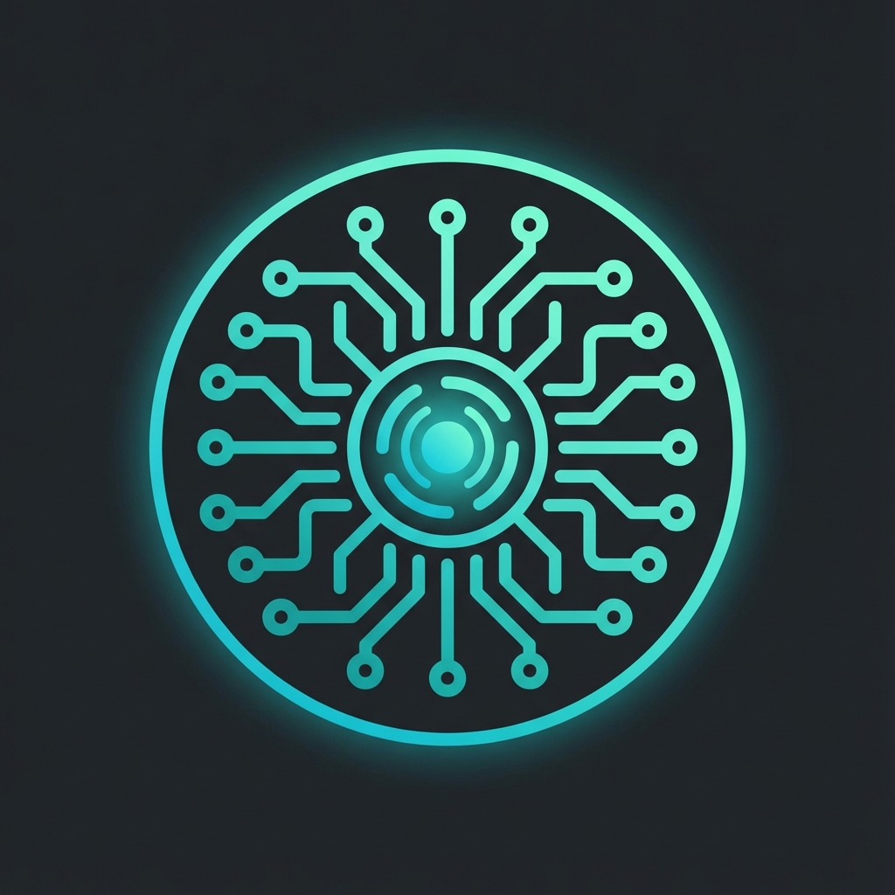

# JARVIS - Local AI Desktop Assistant

<div align="center">



**A complete, offline AI-powered desktop assistant using Ollama + Electron + Python**

[](https://www.python.org/)
[](https://nodejs.org/)
[](https://www.electronjs.org/)
[](https://ollama.ai/)
[](LICENSE)

</div>

---

## 🎯 Overview

JARVIS is a fully local, privacy-focused AI desktop assistant that brings the power of large language models directly to your PC. No cloud dependencies, no API keys required for core functionality.

### Key Features

| Feature | Description |
|---------|-------------|
| 🧠 **Local LLM Chat** | Chat with AI models via Ollama (llama3, qwen, mistral, etc.) |
| 📸 **Screen Reader** | OCR-powered screen capture and text extraction |
| 🎮 **System Control** | Automate keyboard, mouse, and application control |
| 🎤 **Voice I/O** | Speech-to-text (Whisper) and text-to-speech (Piper) |
| 🤖 **Agent System** | Multi-step workflow automation with conditional logic |
| 🧩 **Plugin System** | Extend functionality with custom Python plugins |
| 🔒 **100% Local** | All processing happens on your machine |

---

## 📋 Prerequisites

Before installing JARVIS, ensure you have the following:

### Required

| Software | Version | Download |
|----------|---------|----------|
| **Python** | 3.8 or higher | [python.org](https://www.python.org/downloads/) |
| **Node.js** | 16 or higher | [nodejs.org](https://nodejs.org/) |
| **Ollama** | Latest | [ollama.ai](https://ollama.ai/) |

### Optional (for full features)

| Software | Purpose | Download |
|----------|---------|----------|
| **Tesseract OCR** | Screen text extraction | [GitHub](https://github.com/tesseract-ocr/tesseract) |
| **FFmpeg** | Audio processing | [ffmpeg.org](https://ffmpeg.org/) |

---

## 🚀 Quick Start

### 1. Clone or Download

```bash
git clone https://github.com/yourusername/jarvis.git
cd jarvis
```

### 2. Install Dependencies

**Windows:**
```powershell
.\scripts\install_all.bat
```

**Linux/macOS:**
```bash
chmod +x scripts/*.sh
./scripts/install_all.sh
```

### 3. Pull an Ollama Model

```bash
# Recommended models
ollama pull llama3.1:8b          # General reasoning (4.7GB)
ollama pull qwen2.5-coder:7b     # Coding tasks (4.4GB)
ollama pull mistral:7b           # Fast responses (4.1GB)
```

### 4. Start JARVIS

**Terminal 1 - Backend:**
```powershell
.\scripts\run_backend.bat
```

**Terminal 2 - Frontend:**
```powershell
.\scripts\start_electron.bat
```

---

## 🎮 Usage

### Global Hotkey

| Shortcut | Action |
|----------|--------|
| `Alt + Space` | Toggle JARVIS window |
| `Ctrl + Shift + J` | Focus command input |

### Command Bar

Type natural language commands in the command bar:

```
"Summarize what's on my screen"
"Open notepad and type 'Hello World'"
"What time is it?"
"Explain this code: [paste code]"
```

### Quick Actions

| Button | Action |
|--------|--------|
| 📸 Read Screen | Capture screen and extract text via OCR |
| 🎤 Voice Input | Toggle voice listening mode |
| 🧩 Plugins | Open plugin management panel |
| ⚙️ Settings | Configure models and options |

---

## 📁 Project Structure

```
JARVIS/
│
├── electron-app/                 # Desktop UI (Electron + React)
│   ├── electron.js              # Main Electron process
│   ├── preload.js               # Secure IPC bridge
│   ├── package.json             # Node dependencies
│   ├── public/
│   │   └── index.html           # HTML entry point
│   └── src/
│       ├── App.jsx              # Main React component
│       ├── index.jsx            # React entry point
│       ├── components/
│       │   ├── CommandBar.jsx   # Chat input/output
│       │   ├── Waveform.jsx     # Audio visualization
│       │   ├── HistoryPanel.jsx # Activity history
│       │   ├── Settings.jsx     # Configuration modal
│       │   └── PluginPanel.jsx  # Plugin management
│       └── styles/
│           └── globals.css      # All styles
│
├── backend/                      # Python FastAPI backend
│   ├── main.py                  # API entry point
│   ├── requirements.txt         # Python dependencies
│   ├── config/
│   │   └── settings.py          # Configuration
│   ├── routes/
│   │   ├── chat.py              # LLM chat endpoints
│   │   ├── screen.py            # OCR endpoints
│   │   ├── control.py           # System control
│   │   ├── voice.py             # STT/TTS endpoints
│   │   ├── agent.py             # Workflow automation
│   │   └── plugins.py           # Plugin management
│   ├── modules/
│   │   ├── llm/                 # Ollama integration
│   │   ├── ocr/                 # Screen capture & OCR
│   │   ├── control/             # Mouse, keyboard, system
│   │   ├── voice/               # Whisper & Piper
│   │   ├── agents/              # Workflow engine
│   │   └── utils/               # Logging, file ops
│   └── plugins/                 # Extension plugins
│       ├── youtube_dl/          # Download videos
│       ├── system_stats/        # System monitoring
│       └── auto_summariser/     # Content summarization
│
├── shared/                       # Shared schemas
│   └── ipc_schemas/             # JSON schemas
│
├── scripts/                      # Utility scripts
│   ├── run_backend.bat/.sh      # Start backend
│   ├── start_electron.bat/.sh   # Start frontend
│   └── install_all.bat/.sh      # Install everything
│
└── README.md                     # This file
```

---

## 📡 API Reference

Base URL: `http://localhost:8000/api`

### Chat

| Endpoint | Method | Description |
|----------|--------|-------------|
| `/chat/` | POST | Send message to LLM |
| `/chat/conversation` | POST | Multi-turn conversation |
| `/chat/models` | GET | List available models |

**Example:**
```bash
curl -X POST http://localhost:8000/api/chat/ \
  -H "Content-Type: application/json" \
  -d '{"model": "llama3.1:8b", "prompt": "Hello JARVIS!"}'
```

### Screen

| Endpoint | Method | Description |
|----------|--------|-------------|
| `/screen/read` | POST | Capture screen + OCR |
| `/screen/capture` | POST | Screenshot only |
| `/screen/monitors` | GET | List monitors |

### Control

| Endpoint | Method | Description |
|----------|--------|-------------|
| `/control/mouse/click` | POST | Mouse click |
| `/control/mouse/move` | POST | Move mouse |
| `/control/keyboard/type` | POST | Type text |
| `/control/keyboard/hotkey` | POST | Press hotkey |
| `/control/app/open` | POST | Open application |
| `/control/system/info` | GET | System information |

### Voice

| Endpoint | Method | Description |
|----------|--------|-------------|
| `/voice/transcribe` | POST | Speech to text |
| `/voice/speak` | POST | Text to speech |
| `/voice/status` | GET | Voice module status |

### Plugins

| Endpoint | Method | Description |
|----------|--------|-------------|
| `/plugins/` | GET | List all plugins |
| `/plugins/{name}` | GET | Plugin details |
| `/plugins/{name}/run` | POST | Execute plugin command |

---

## 🧩 Plugins

### Included Plugins

| Plugin | Description | Commands |
|--------|-------------|----------|
| **youtube_dl** | Download YouTube videos/audio | `download`, `audio`, `info` |
| **system_stats** | Monitor system resources | `stats`, `monitor`, `processes` |
| **auto_summariser** | Summarize content | `summarize`, `summarize_screen`, `summarize_clipboard` |

### Creating a Plugin

1. Create folder: `backend/plugins/my_plugin/`

2. Add `manifest.json`:
```json
{
  "name": "my_plugin",
  "description": "What this plugin does",
  "version": "1.0.0",
  "author": "Your Name",
  "entry": "main.py",
  "commands": ["command1", "command2"]
}
```

3. Add `main.py`:
```python
class Plugin:
    def __init__(self):
        self.name = "My Plugin"
    
    def run(self, command: str, params: dict):
        if command == "command1":
            return {"result": "success"}
        return {"error": "Unknown command"}

plugin = Plugin()
```

---

## ⚙️ Configuration

### Environment Variables

Create a `.env` file in the `backend/` folder:

```env
# Ollama
OLLAMA_HOST=http://localhost:11434
DEFAULT_MODEL=llama3.1:8b

# OCR
TESSERACT_CMD=C:/Program Files/Tesseract-OCR/tesseract.exe
OCR_LANGUAGE=eng

# Voice
WHISPER_MODEL=base
PIPER_PATH=piper
PIPER_MODEL=en_US-lessac-medium.onnx

# API
API_HOST=127.0.0.1
API_PORT=8000
DEBUG_MODE=false

# Features
ENABLE_OCR=true
ENABLE_VOICE=true
ENABLE_SYSTEM_CONTROL=true
```

---

## 🔧 Troubleshooting

### Common Issues

| Issue | Solution |
|-------|----------|
| **"Cannot connect to Ollama"** | Ensure Ollama is running: `ollama serve` |
| **"No models found"** | Pull a model: `ollama pull llama3.1:8b` |
| **OCR not working** | Install Tesseract and set `TESSERACT_CMD` |
| **Backend won't start** | Check Python dependencies: `pip install -r requirements.txt` |
| **Electron won't start** | Check Node dependencies: `npm install` |

### Logs

- **Backend logs**: `backend/logs/jarvis.log`
- **Electron logs**: DevTools console (Ctrl+Shift+I)

---

## 🎯 Roadmap

- [x] Electron + React UI
- [x] FastAPI Backend
- [x] Ollama Integration
- [x] Screen Reader (OCR)
- [x] System Control
- [x] Plugin System
- [x] Workflow Engine
- [x] Voice Input (Whisper)
- [x] Voice Output (Piper/SAPI)
- [x] Advanced Agents
- [x] Auto-Debugger Plugin
- [x] Browser Automation
- [x] Scheduled Tasks
- [ ] Voice Activation ("Hey JARVIS")
- [ ] Multi-language Support
- [ ] Custom Themes

---

## 🤝 Contributing

Contributions are welcome! Please feel free to submit a Pull Request.

1. Fork the repository
2. Create your feature branch (`git checkout -b feature/AmazingFeature`)
3. Commit your changes (`git commit -m 'Add some AmazingFeature'`)
4. Push to the branch (`git push origin feature/AmazingFeature`)
5. Open a Pull Request

---

## 📄 License

This project is licensed under the MIT License - see the [LICENSE](LICENSE) file for details.

---

## 🙏 Acknowledgments

- [Ollama](https://ollama.ai/) - Local LLM runtime
- [Electron](https://www.electronjs.org/) - Desktop app framework
- [FastAPI](https://fastapi.tiangolo.com/) - Python API framework
- [Tesseract](https://github.com/tesseract-ocr/tesseract) - OCR engine
- [Whisper](https://github.com/openai/whisper) - Speech recognition
- [Piper](https://github.com/rhasspy/piper) - Text-to-speech

---

<div align="center">

**Built with ❤️ for local AI enthusiasts**

[Report Bug](https://github.com/yourusername/jarvis/issues) · [Request Feature](https://github.com/yourusername/jarvis/issues)

</div>
